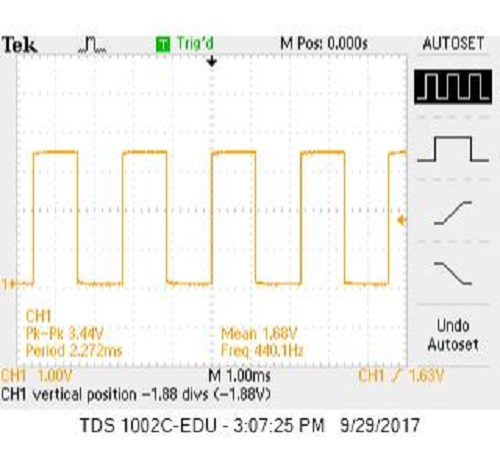
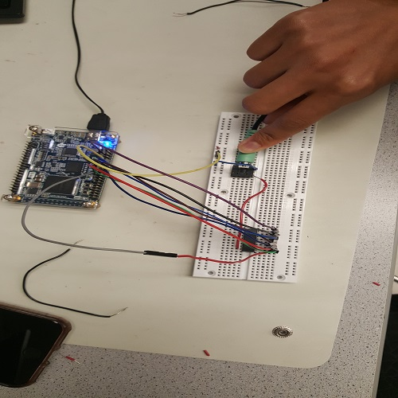
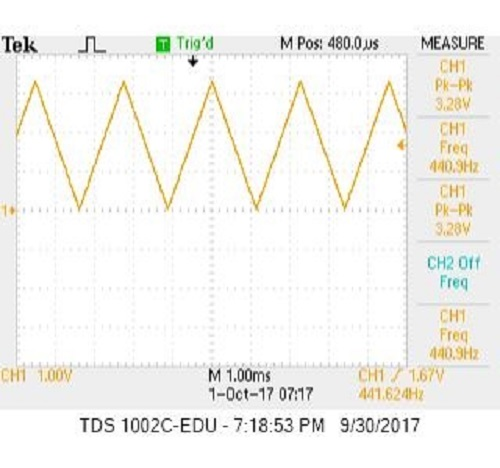
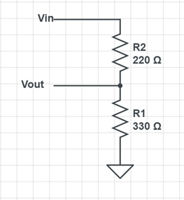
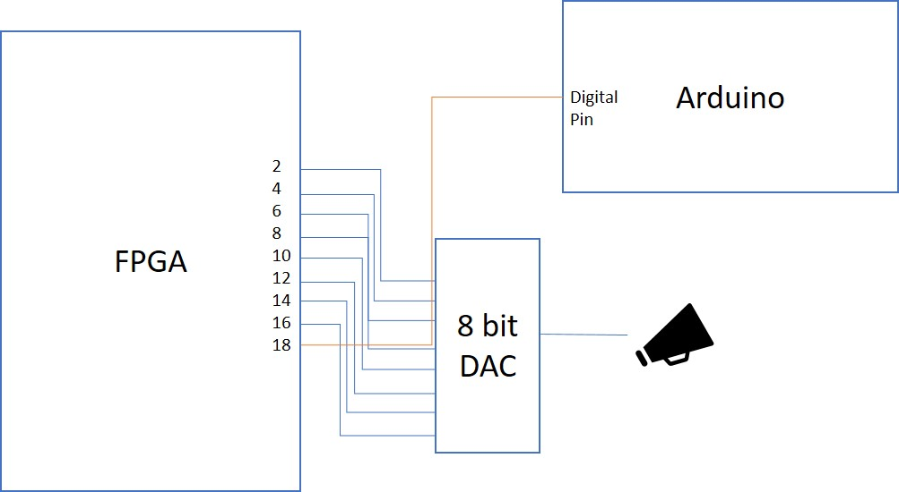

# Acoustics

## Overview of port declarations and initializations

To declare variables in Verilog, we use input, output, registers and wires. Input and output define the variable as something that will come in and something that will go out, respectively. Registers are used to store information (such as state variables), and wires literally behave as simple wires with arbitrary width. Follow [these rules] (https://inst.eecs.berkeley.edu/~cs150/Documents/Nets.pdf)  to use them correctly!

To initialize pins on the FPGA, we use the default pin registers (GPIO_0_D) that initializes all the pins as inputs and outputs (use inout). 

At the top, all inputs and outputs are initialized in a module declaration. For example:

``` 
module example(
	Clock,
	GPIO_0_D,
	test_variable);
```

## Square Wave

To generate a square wave, we used a simple two-state state machine with an decrementing counter that outputs a 440 Hz or 0 Hz tone based on the counter value. To determine the counter value, we used the following steps:
The state machine is clocked at 25 MHz and the period of the wave is 440 Hz, so the total number of clock cycles per wave cycle must be: 25MHz/440Hz = 56818 cycles.

The square wave is essentially a toggle from 0 to 1, so the total number of toggles must be #cycles/2. Therefore, the wave should toggle approximately every 28409 cycles, and the value of counter should be instantiated as this value.

Within our state machine, we first check if our counter is equal to 0; if the counter is 0, then we toggle the square wave (a binary 1 or 0 that is assigned to an output register). If the counter is not zero, then the square wave toggle bit should retain its value and decrement the counter by 1. 

To test if we were generating a correct wave at the correct frequency, we tested on the oscilloscope as well as with a speaker. This is what the wave should look like: 



>Figure xx. Square wave at 440 Hz. 

## Triangle Wave

To generate a triangle wave, we followed similar logic as the square wave, but the state machine was a little more complex, and we used an [8-bit R2R DAC](http://www.bourns.com/docs/Product-Datasheets/R2R.pdf) to convert an 8 bit digital output to analog voltages. 



>Figure xx. Set up with 8 bit DAC.

Unlike a square wave which toggles, a triangle wave ramps up and down in one cycle (from 0 to 255 and back down). As a result, we had two counters:
1) Counter: Kept track of the number of CPU cycles that must pass until the next wave is generated. We calculated this by taking 	the total number of CPU cycles for toggling (calculated above) by 255 (one ramp). This gives us approximately 110 cycles. 
2) Counter2: This was used to keep track of our count up and count down. When counter is 110, we check the value of counter 2 and output the respective value to the FPGA. The range of this counter was 0 to 509 (255 * 2 to account for a ramp up and down). 
 



>Figure xx. Triangle wave at 440 Hz. 

## Three-frequency tune

The program used to generate three distinct frequencies is divided into two modules: makeTone and DE0_NANO2. makeTone uses the same structure as the program used to generate a single frequency tone as described above. Here’s the version of the single tone code used for this section 
…..

DE0_NANO2 is at the top of our project’s hierarchy, it controls which frequency is played and contains the logic to detect a sound enable signal. The module uses two additional variables to keep track of the sound: tone_duration_counter tracks how long the current tone has played and tone_number_counter tracks which frequency is being played. The always block of the module contains an if-else branch that decides which tone to play based on the value tone_number_counter. The logic for the three tones in the if-elseif branches is as follows:

	Enable sound
	Set frequency of tone to be played
	Calculate clock cycles to play this frequency 
	If tone has played for one second{
		Reset tone duration counter
		Switch to next tone
	}
	Else{
		Keep playing current tone, increment tone duration counter
	}

Additionally, there is an else branch in DE0_NANO2 that disables the sound and resets the tone counter to the first one so that the tune can loop. 

Here’s the code for the DE0_NANO2 module
….

Since the tone’s frequency changes, we have to do some additional calculation to determine 1) how many cycles the triangle wave should take to go from 0 to 255 and back to 0 and 2) how often to increment the wave output value to meet the timing requirement of 1. Here’s the math:

Cycles to go from 0->255->0, stored in variable “CLKDIVIDER”
		CLKDIVIDER = state machine clock speed / desired frequency / 2
For 440 Hz	CLKDIVIDER = 25 MHz / 440 Hz/ 2
		CLKDIVIDER = 28409

Cycles to determine how often to increment wave output by 1, stored in variable “cycles “
		cycles = CLKDIVIDER / number of steps
		cycles = CLKDIVIDER / 256				256 steps for 0 to 255
For 440 Hz	cycles = 28409 / 256
		cycles = 110

These values match the code for the single tone 440 Hz triangle wave. CLKDIVIDER is calculated in each if/elseif statement in DE0_NANO2 and then passed as an input to makeTone to calculate cycles. These values determine how quickly the wave steps from 0 to 255 and therefore generate the difference in sound. Here the difference in this video of our three tone tune, readings from the oscilloscope also show the different frequencies. The frequency being played is shown in the bottom right hand corner. [Here's a video.] (https://youtu.be/L3GszLX1wvM)

## Enable tone with Arduino

In order to toggle the tune that we created on and off, we introduced an enable signal that comes from the Arduino. The signal outputs from one of the digital pins on the Arduino and inputs to one of the default pins on the FPGA - in this case we used pin 18. Since a logic high signal coming from the Arduino is 5V and a logic high input for the FPGA must be 3.3V, we had to create a voltage divider circuit to scale the signal coming from the Arduino. To make this circuit we placed two resistors in series with resistances of 330 Ohms and 220 Ohms. 



> Figure xx. Voltage divider circuitry. 



>Figure xx. Block diagram of our pins and circuitry.

To test the enable signal, we created a simple Arduino Uno program that tells the digital pin to output a logic high for three seconds and then a logic low for one second. In makeTone we added a conditional statement within the always block:

'''
If pin GPIO_0_D_18 receives a logic high signal from Arduino{
	Increment counters
Play current tone
}
Else{
	Stop playing the current tone
	Reset all counters 
}

'''

With the enable implemented we can now turn the tune on/off with a simple enable signal coming from the Arduino. In [this video](https://www.youtube.com/watch?v=aGEa08fkF8c), the top channel shows the output of the Arduino (the enable signal) and the other channel shows the three tone triangle wave.


